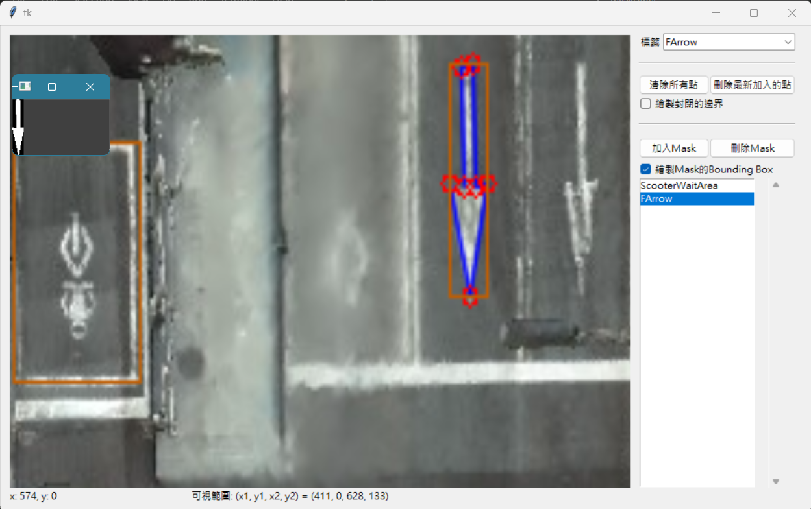
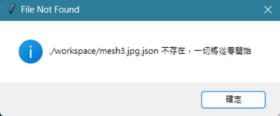
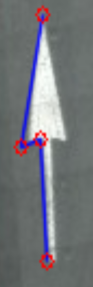
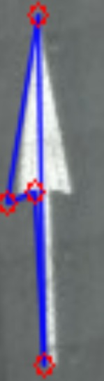
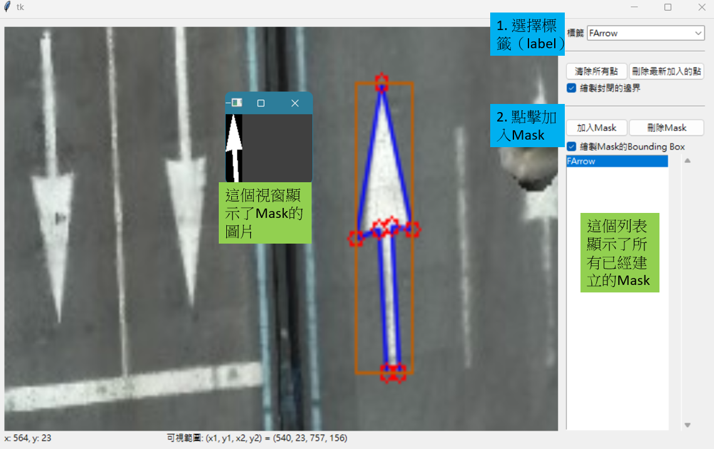

# About

在圖片上標識遮罩的工具，本工具可以在圖片上框出數個多邊形遮罩，並將其匯出。



匯出的資訊包含：
- 遮罩的bounding box的座標（如圖中的棕色方框）
- 遮罩的label
- 代表遮罩的二維陣列（藍色框線框住的部份在遮罩中為白色）

# How to Use

Step1. git clone後開啟本資料夾

```sh
git clone https://github.com/jeang-bo-yuan/MaskLabel
cd MaskLabel
```

Step2. 將要標記的圖片放在`workspace/`下

Step3. 執行`main.py`

```sh
python main.py
```

Step4. 選擇要標記的圖片，選擇圖片後會自動從`workspace/`中讀取相對應的json檔以繼續之前的進度。

如果是第一次開啟圖片的話，會出現如下的訊息，提示你`workspace/`中還沒有這張圖片的標記結果。



Step 5. 繪製多邊形

在左側畫面中點擊`滑鼠左鍵`會新增一個邊界點，這個點以紅色表示。而邊界點會連成多邊形，它的邊以藍色表示。



如果勾選右側的「繪製封閉的邊界」，則會將頭尾相連，承現出最終的多邊形的模樣。



Step 6. 建立遮罩

框好多邊形後即可建立遮罩。在建立之前你要先選擇這個遮罩的標籤，然後再點擊下方的「加入Mask」



Step 7. 存檔

按下`Control-s`或者在關閉視窗時，都會跳出是否要存檔的對話框。點擊「是」即可存檔。

如果開啟的檔案是`foo.jpg`，那麼標記的結果會存在`./workspace/foo.jpn.json`內。


# Hot Keys

- 在左測畫面中
    - `左鍵`: 新增邊界點
    - `滑鼠滾輪`: 縮放
    - `按住右鍵拖動`: 移動可視範圍

- 在右下角選擇Mask後
    - `f` 或 `左鍵點兩下`: 聚焦並顯示遮罩
    - `Delete`: 刪除遮罩

- `Control-z`: 刪掉最新加入的邊界點
- `Control-s`: 儲存標記的結果


# Output Format

假設輸出的檔名是`foo.jpg.json`，則其架構大致如下：

```json
{
    "foo.jpg": {
        "0 (這個是流水號)": {
            "bbox": "一個型如[x1, y1, x2, y2]的列表，(x1, y1)和(x2, y2)分別代表bounding box的左上和右下角",
            "label": "遮罩的標籤",
            "Mask": "一個二維陣列，0->黑色，255->白色"
        },
        "1": {
            ...
        },
        ...,
        "N" {
            ...
        }
    }
}
```

# Setting JSON

`workspace/setting.json`是設定檔，格式如下：

```json
{
    "WHEEL_SENSITIVITY": "(float) Zoom In / Zoom Out的靈敏度",
    "MOUSE_SENSITIVITY": "(float) 拖動畫面的靈敏度",
    "label": "(list of string) 所有可選的標籤"
}
```

（value欄位的字串只是說明文字，祥細型別在括號內，或者參見預設的`workspace/setting.json`）